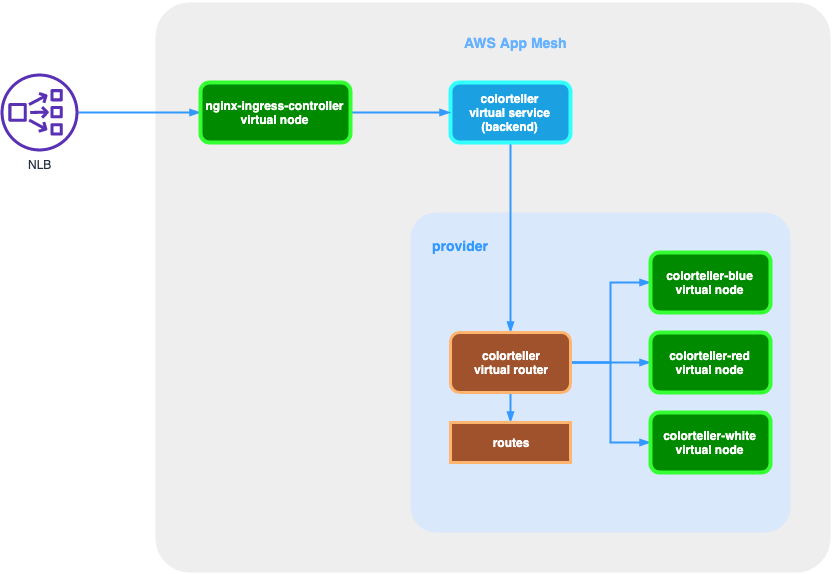

# App Mesh Integration with Ingress nginx
This repository illustrated how to setup [Ingress-nginx](https://github.com/kubernetes/ingress-nginx) work with AWS App Mesh example application [Color App](https://github.com/aws/aws-app-mesh-examples/tree/master/examples/apps/colorapp)

## How it works


Key takeaways:
* Create App Mesh VirtualNode for deployment nginx-ingress-controller
* Set backends for VirtualNode, nginx-ingress-controller will call service colorteller.appmesh-demo and kubernetes.
* ingress-nginx will get endpoints (Pod IP:port) of service as upstream for nginx by default, we must set upstream point to service to egress traffic intercepted by envoy.
* Host of upstream request must be the service name

## Deployment
### 1. create eks cluster with eksctl
```bash
REGION=ap-southeast-1
export MESH_NAME=color-mesh
eksctl create cluster --region $REGION --name appmesh-test --version 1.13 --appmesh-access
```

### 2. install appmesh controller
```bash
kubectl apply -f https://raw.githubusercontent.com/aws/aws-app-mesh-controller-for-k8s/master/deploy/all.yaml
```

check controller resources
```bash
kubectl rollout status deployment app-mesh-controller -n appmesh-system
kubectl get crd
```

### 3. install appmesh side car injector
```bash
curl https://raw.githubusercontent.com/aws/aws-app-mesh-inject/master/scripts/install.sh | bash
```

### 4. install color teller sample application
```bash
kubectl apply -f https://raw.githubusercontent.com/aws/aws-app-mesh-controller-for-k8s/v0.1.0/examples/color.yaml
```

### 5. install ingress-nginx and app mesh virtual node
```bash
kubectl create ns ingress-nginx
kubectl label namespace ingress-nginx appmesh.k8s.aws/sidecarInjectorWebhook=enabled
kubectl apply -f https://raw.githubusercontent.com/kubernetes/ingress-nginx/master/deploy/static/mandatory.yaml
kubectl apply -f https://raw.githubusercontent.com/kubernetes/ingress-nginx/master/deploy/static/provider/aws/service-nlb.yaml
kubectl apply -f ./nginx-ingress-appmesh.yaml
kubectl apply -f ./nginx-ingress.yaml
```

watch query result of ingress:
```bash
ELB_URL=$(kubectl get svc ingress-nginx -n ingress-nginx -o jsonpath="{.status.loadBalancer.ingress[0].hostname}")
watch -t curl -s http://$ELB_URL/color; echo;
```

### 6. clean up
```bash
kubectl delete ns ingress-nginx
kubectl delete crd meshes.appmesh.k8s.aws
kubectl delete crd virtualnodes.appmesh.k8s.aws
kubectl delete crd virtualservices.appmesh.k8s.aws
kubectl delete namespace appmesh-system
kubectl delete namespace appmesh-inject
eksctl delete cluster appmesh-test
```
